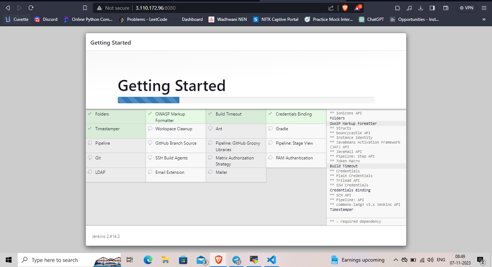

# 1. Installing Jenkins

First, update the default Ubuntu packages lists for upgrades with the following command:
```bash
sudo apt-get update
```
Then, run the following command to install JDK 11:
```bash
sudo apt-get install openjdk-11-jdk
```
Now, we will install Jenkins itself. Issue the following four commands in sequence to initiate the installation from the Jenkins repository:
Used this as a resourse - https://pkg.origin.jenkins.io/debian-stable/

This is the Debian package repository of Jenkins to automate installation and upgrade. To use this repository, first add the key to your system (for the Weekly Release Line):
```bash
sudo wget -O /usr/share/keyrings/jenkins-keyring.asc \
https://pkg.jenkins.io/debian-stable/jenkins.io-2023.key
```

Then add a Jenkins apt repository entry:
```bash
echo deb [signed-by=/usr/share/keyrings/jenkins-keyring.asc] \
https://pkg.jenkins.io/debian-stable binary/ | sudo tee \
/etc/apt/sources.list.d/jenkins.list > /dev/null
```

Update your local package index, then finally install Jenkins:
```bash
sudo apt-get update
sudo apt-get install fontconfig openjdk-11-jre
sudo apt-get install jenkins
```

Once that’s done, start the Jenkins service with the following command:
```bash
sudo systemctl start jenkins.service
```
To confirm its status, use:
```bash
sudo systemctl status jenkins
```
With Jenkins installed, we can proceed with adjusting the firewall settings. By default, Jenkins will run on port 8080.

In order to ensure that this port is accessible, we will need to configure the built-in Ubuntu firewall (ufw). To open the 8080 port and enable the firewall, use the following commands:
```bash
sudo ufw allow 8080
```
```bash
sudo ufw enable
```
Once done, test whether the firewall is active using this command:
```bash
sudo ufw status
```
With the firewall configured, it’s time to set up Jenkins itself. Type in the IP of your EC2 along with the port number. The Jenkins setup wizard will open.

To check the initial password, use the cat command as indicated below:
```bash
sudo cat /var/lib/jenkins/secrets/initialAdminPassword
```
We will use the above password later on.
All Set! You can now start automating...


Then when you type your <ec2-instance-ip>:jenkins-port-number(i.e.8080), we get a page, install required plugins. Before that we need to put the administrative password which we have copied previously.




Then create your own account and and signup


There you go! You will see the dashboard page.


Now, enable firewall by passing following command.
```bash
ufw enable
```
That’s all. Now on, your Jenkins server will run behind the Apache’s Reverse Proxy.

